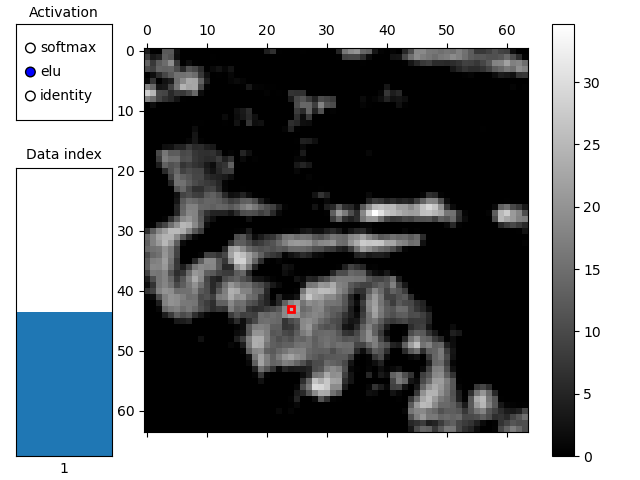

# att_vis
matplotlib-based utility for visualizing attention volumes from vision transformer-like models

The visualization uses query and key tensors (4D: batch, channels, height, width) as inputs.

Note that, as the data is serially processed on the CPU using numpy, large attention volumes can lead to slow startup and response times. This can be alleviated to a certain extent by setting `precompute_sim` to `False`, which changes behavior to always re-compute results locally instead of pre-computing them and later performing lookups.

## Requirements

 * Python 3.7+

### Python packages

 * numpy
 * matplotlib
 * skimage (demo only)
 * torch (demo only)
 * torchvision (demo only)

## Overview

`att_vis.py` contains the code for the utility and can be used to visualize attention volumes given query and key tensors.

A runnable demo that shows how the visualization can be launched using sample inputs can be found in `demo.py`.
